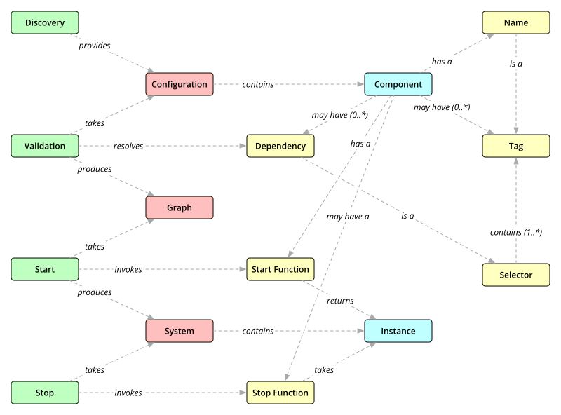

# Concepts

## Component

Metadata describing a building block of the software system.

A component consists of:

* A name
* An optional set of tags
* Zero or more dependency selectors
* A start function
* An optional stop function

## Configuration

A collection of components, describing a system.

## Tag

Identifies components.  Every component has a name, which is a tag, and can
have additional tags.  Tags can have is-a relationships, so that they form
graphs.

## Selector

Criteria to select components in a configuration.  A selector consists of one
or more tags.  A components matches a selector if it provides all tags in the
selector.

## Dependency

A selector specifying a component or set of components that a component
depends on.

Dependencies usually are _unique_, requiring exactly one matching component in
the configuration.  Optional dependencies specify a set of zero or more
matching components.

## Dependency Graph

A data structure derived from a configuration, by resolving component
dependencies, and detecting _unsatisfied_ and _ambiguous_ dependencies.

## Component Instance

A concrete instance of a component, a value returned from the component's
start function.

## System

A map of component instances, obtained from the configuration with the help of
a dependency graph.
