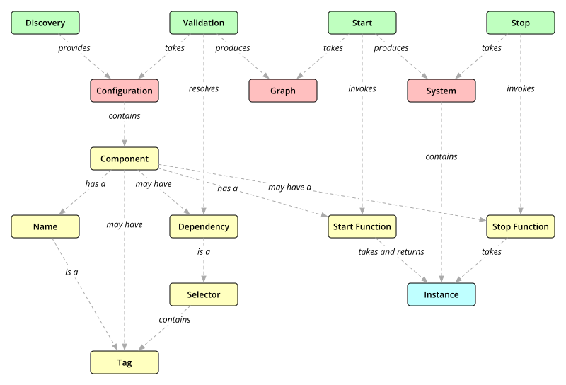

# Design

The following diagram shows an overview of Init's design:

## Component

Metadata describing a building block of the software system.

A component is a **map** containing the following keys:

* `:name` - Required. The component's [name](#name)
* `:tags` - Optional.  Set of additional [tags](#tag)
* `:deps` - Optional.  Sequence of [dependencies](#dependency)
* `:start-fn` - Required.  The component's [start function](#start-function)
* `:stop-fn` - Optional.  The component's [stop function](#stop-function)

Init supports deriving component maps from [var metadata](metadata.md).

## Name

Uniquely identifies the [component](#component).  A name is a namespace-qualified
**keyword** or **symbol**.  Every name is also a [tag](#tag).

## Tag

Organize [components](#component).  Tags are namespace-qualified **keywords**
or **symbols**, or **classes**.

Tags can further be organized using the global **hierarchy** using `derive`.

A component is said to _provide_ a tag, when its name or one of its tags _is-a_
given tag, as determined by `isa?`.

## Configuration

A collection of [components](#component), describing a [system](#system).

A configuration is a **map** of component [names](#name) to components.

## Discovery

The process of obtaining a [configuration](#configuration).

There are [many options for discovering components](discovery.md), ranging from
building a configuration map manually to automated
[classpath scanning](discovery.md#classpath-scanning).
The result, however, is always a configuration map.

## Selector

Criteria to select [components](#component) in a [configuration](#configuration).
A selector is a [tag](#tag), or a collection of tags.

A components matches a selector if it provides all tags in the selector.

## Dependency

A [selector](#selector) specifying a [component](#component) or set of components
that a given component depends on.

In addition to being a selector, a dependency defines if a referenced component
is _required_ or _optional_, and whether an _unambiguous_ match is required.

If a dependency is a **set** of [tags](#tag), it is considered optional and
ambiguous, meaning that the component will receive zero or more matches.

If a dependency is a single tag or a sequence of tags, it requires a _unique_
match, and dependency resolution will fail if no matching component exists in the
configuration, or multiple candidates match the selector.

## Graph

A data structure derived from a [configuration](#configuration), containing
resolved component [dependencies](#dependency).
Graphs are directed and acyclic (DAG).

## Validation

The process of building a [graph](#graph) from a [configuration](#configuration),
by resolving [dependencies](#dependency) and validating their requirements.

## Instance

A concrete instance of a [component](#component).  Instances can be any values,
mutable or immutable, including `nil`.

## Start function

A function returning a component's [instance](#instance), with the help of any
instances from its [dependencies](#dependency).

Stop functions need to accept a sequence of collections: For every dependency,
a collection of instances of all matching components.

Init supports building start functions from
[inject specifications](metadata.md#injecting-dependencies).

## System

A **map** of [names](#name) to [instances](#instance).

## Start

The process of starting a [system](#system) from a [graph](#graph), by invoking
each [component's](#component) [start function](#start-function) in
dependency order.

## Stop function

A function taking an [instance](#instance) and performing any shutdown or
cleanup required.  A stop function's return value is ignored.

## Stop

The process of stopping a [system](#system) by invoking each
[component's](#component) [stop function](#stop-function) in
reverse dependency order.
